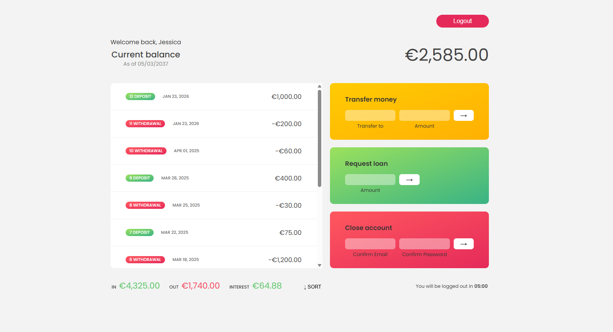
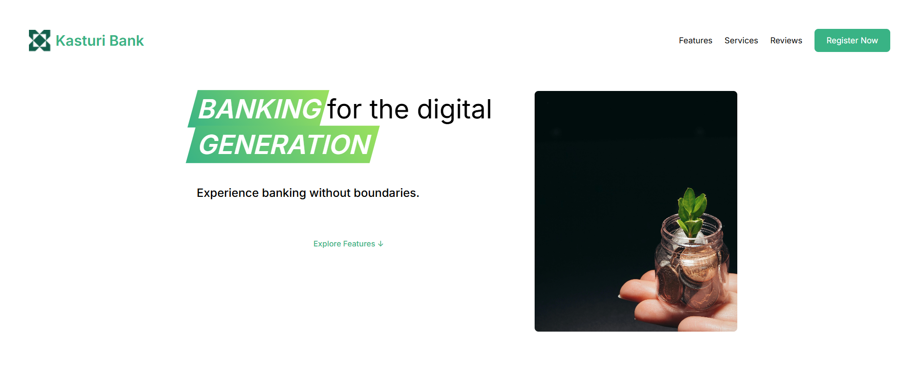
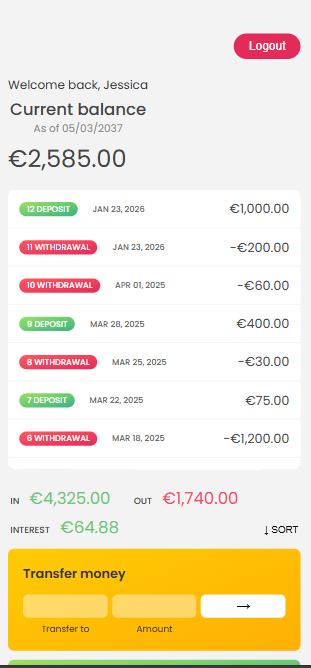
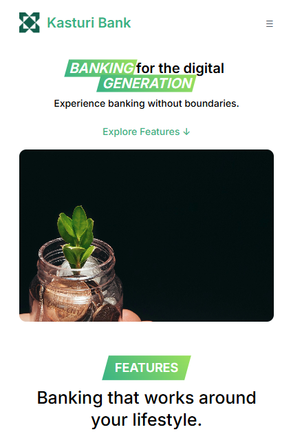

#Reference : This project UI is taken and inspire from Jonas Schmedtmann who is a instructor from portugal and i develope backend and some frontend logic to make it full-stack project.

# Kasturi Bank (Demo)

project overview

## Demo Preview

- Demo video:

  <video controls width="720">
    <source src="frontend/images/bank-demo.mp4" type="video/mp4">
    Your browser does not support the video tag.
  </video>

- Preview images:

  <p>
    
    
  </p>

  <p>
    
    
  </p>

Small demo banking app with Node/Express backend and static frontend.

Overview

- Backend: Express + Mongoose models for `User` and `Movement`.
- Frontend: Vanilla JS single-page UI under `frontend/` (app.html + app.js).
- Purpose: demo account flows -- signup, login, view movements, transfer, loan request, close account.

Repository structure

- `backend/` — server code
  - `server.js` — entry
  - `src/app.js` — express app and route mounting
  - `src/controller/` — controllers (including `auth.controller.js`, `seed.controller.js`)
  - `src/routes/` — routes (`auth.routes.js`, `seed.routes.js`)
  - `src/model/` — Mongoose models (`user.model.js`, `movement.model.js`)
  - `data/fake-data.json` — seed data used by `/api/v1/seed/import`
- `frontend/` — static UI
  - `app.html`, `app.js`, `app.css` — main bank app
  - `index.html` — (login/signup page) — see project files

Prerequisites

- Node.js (>=14)
- MongoDB accessible (local or remote)

Environment

- Copy `.env.example` or set environment variables used by the project. At minimum configure `MONGODB_URI` and `NODE_ENV` if needed.

Install & Run (backend)

1. From project root:

```bash
cd backend
npm install
```

2. Start the server:

```bash
node server.js
```

By default the app listens on port `3000`.

Seed data

- There's a JSON file at `backend/data/fake-data.json` with 10 users and 100 movements.
- To import seed data run (server must be running):

```bash
curl -X POST http://localhost:3000/api/v1/seed/import
```

API (summary)

- All endpoints are prefixed with `/api/v1` per `src/app.js`.

- Auth
  - `POST /api/v1/auth/signup` — create user
    - body: `{ name, email, password, confirmPassword, amount }` (amount optional — creates initial movement)
  - `POST /api/v1/auth/login` — login
    - body: `{ email, password }`
    - Response sets `token` cookie (httpOnly). Frontend uses `credentials: 'include'`.
  - `GET /api/v1/auth/logout` — clears auth cookie
  - `GET /api/v1/auth/me` — get current user + populated `movement` list (protected)

- Account operations (protected; require cookie)
  - `POST /api/v1/auth/transfer` — transfer to another user
    - body: `{ toEmail, amount }`
  - `POST /api/v1/auth/loan` — request loan
    - body: `{ amount }` — simple eligibility rule: grant if any past deposit >= 10% of requested amount
  - `DELETE /api/v1/auth/close` — close account
    - body: `{ email, password }` — verifies and deletes user and movements

Notes about auth and cookies

- The server sets an httpOnly cookie named `token`. When calling protected endpoints from the browser, the frontend sends `credentials: 'include'` and the server enables CORS accordingly.
- When clearing cookies on logout, the backend uses `res.clearCookie('token', cookieOptions)` where `cookieOptions` matches the options used when the cookie was set.

Data models

- User (see `backend/src/model/user.model.js`):
  - name, email, password (hashed), confirmPassword (validation), interestRate, passwordChangedAt
  - virtual `movement` references Movement documents
- Movement (see `backend/src/model/movement.model.js`):
  - amount (Number), date (Date), user: ObjectId -> `User`

Frontend

- `frontend/app.html` and `frontend/app.js` implement the app view.
  - On load `app.js` requests `/auth/me` and renders movements, balance, and summary.
  - Movement entries show formatted amounts and dates using `Intl.NumberFormat` and `Intl.DateTimeFormat`.
  - Sorting is available via the SORT button (toggles ascending/descending by amount).
  - Transfer, Loan, and Close account operations call the respective backend endpoints and refresh the UI.
  - There's an inactivity logout timer shown in the UI (`.timer`) that logs out after 5 minutes of inactivity.

Developer notes

- Seed import creates users and maps original payload `_id` values to created documents so `movements.user` refers to the correct created user ids.
- Password hashing is handled by user model pre-save middleware (bcrypt).
- Be careful with CORS and `credentials: 'include'` — `src/app.js` configures CORS to allow `http://127.0.0.1:5500` (change to your frontend host if needed) and `credentials: true`.

Testing endpoints with curl

- Login (example):

```bash
curl -i -X POST http://localhost:3000/api/v1/auth/login \
  -H 'Content-Type: application/json' \
  -d '{"email":"jonas@example.com","password":"password123"}'
```

Note: to persist cookies across curl calls use `-c cookies.txt` and `-b cookies.txt`.

Troubleshooting

- If frontend cannot fetch `/auth/me`, ensure:
  - backend is running on port 3000
  - browser fetch includes credentials and server CORS allows your frontend origin
  - auth cookie present in the browser

Future improvements

- Rate-limiting and input sanitization
- More robust loan eligibility rules
- Pagination for movements
- Unit/integration tests for controllers

License

- This repo is a demo; add an appropriate license if you plan to distribute.

# kasturi-bank
